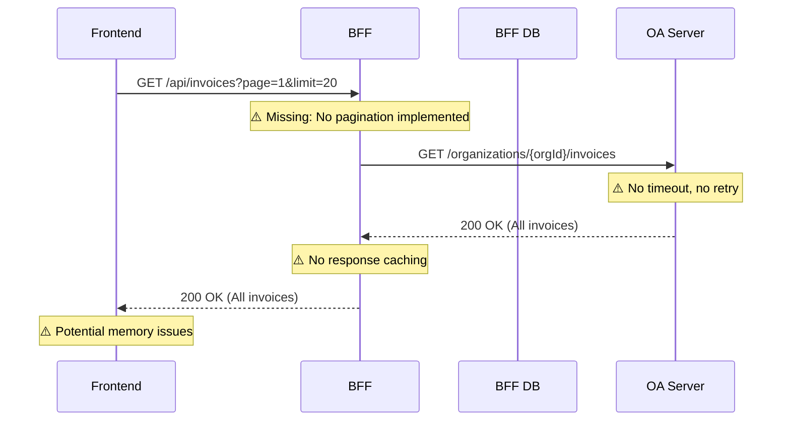
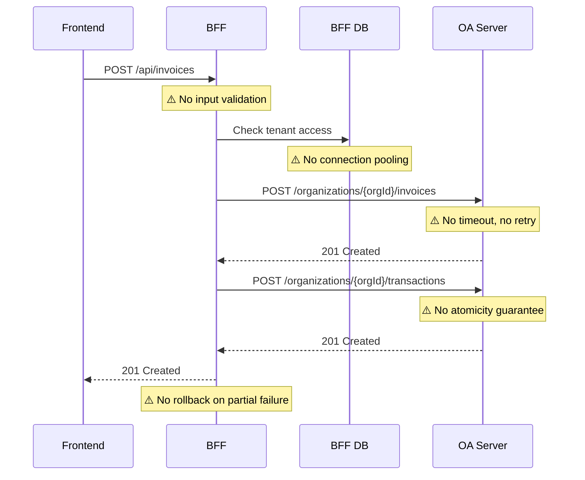
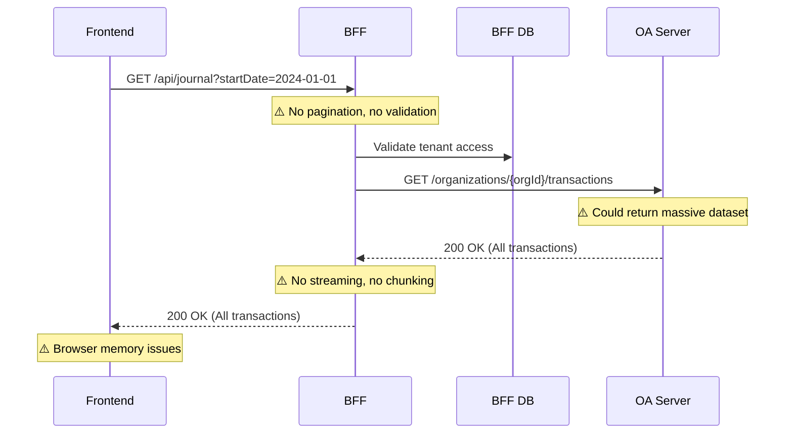

# BFF Architecture Documentation

## Overview

The Backend-for-Frontend (BFF) serves as a multi-tenant bookkeeping SaaS integration layer with OpenAccounting (OA). It provides authentication, tenant isolation, and API orchestration between the frontend and the OA server.

## Current Architecture Issues ⚠️

**Critical Problems Identified:**
1. **Performance**: No connection pooling, no timeouts, blocking I/O patterns
2. **Reliability**: Missing retries, circuit breakers, error taxonomy
3. **Security**: Inconsistent tenant isolation, potential cross-tenant data leaks
4. **Observability**: Minimal logging, no tracing, no metrics
5. **API Design**: Inconsistent response formats, no pagination, no validation

## System Components

```
┌─────────────────┐    ┌─────────────────┐    ┌─────────────────┐
│   Frontend      │    │      BFF        │    │ OpenAccounting  │
│   (Next.js)     │◄──►│   (Express)     │◄──►│    Server       │
│                 │    │                 │    │                 │
└─────────────────┘    └─────────────────┘    └─────────────────┘
                              │
                              ▼
                       ┌─────────────────┐
                       │   BFF Database  │
                       │    (MySQL)      │
                       └─────────────────┘
```

## API Endpoint Inventory

### Authentication Routes (`/auth`)
- `POST /auth/login` - Email/password authentication
- `POST /auth/register` - User registration with organization creation
- `GET /auth/me` - Current user info
- `GET /auth/google` - OAuth initiation (disabled)
- `GET /auth/google/callback` - OAuth callback (disabled)

### Core Business Routes (`/api`)
- `GET /api/accounts` - List chart of accounts ⚠️ **No pagination**
- `POST /api/accounts` - Create account ⚠️ **No validation**
- `GET /api/accounts/:id` - Get account details
- `PUT /api/accounts/:id` - Update account ⚠️ **No tenant check**
- `DELETE /api/accounts/:id` - Delete account

- `GET /api/items` - List products/services ⚠️ **No pagination**
- `POST /api/items` - Create item ⚠️ **No validation**
- `GET /api/items/:id` - Get item details
- `PUT /api/items/:id` - Update item
- `DELETE /api/items/:id` - Delete item

- `GET /api/customers` - List customers ⚠️ **No pagination**
- `POST /api/customers` - Create customer
- `GET /api/customers/:id` - Get customer
- `PUT /api/customers/:id` - Update customer
- `DELETE /api/customers/:id` - Delete customer

- `GET /api/vendors` - List vendors ⚠️ **No pagination**
- `GET /api/bank-accounts` - List bank accounts ⚠️ **No pagination**
- `GET /api/metrics` - Dashboard metrics

### Health & Monitoring
- `GET /health` - Basic health check
- `GET /health/ready` - Readiness probe
- `GET /health/live` - Liveness probe

## Data Flow Diagrams

### Critical Flow 1: List Invoices


### Critical Flow 2: Create Invoice + Record Payment


### Critical Flow 3: List Ledger Entries


## Multi-Tenancy Implementation

### Current State ⚠️
```typescript
// PROBLEMATIC: Inconsistent tenant isolation
router.get('/', requireJwtAuth, async (req, res) => {
  const accounts = await prisma.ledgerAccount.findMany({
    where: { organizationId: req.auth!.organizationId }, // ✅ Good
  })
})

router.put('/:id', requireJwtAuth, async (req, res) => {
  const updated = await prisma.ledgerAccount.update({
    where: { id: req.params.id }, // ⚠️ BAD: No tenant check!
    data: { code, name, type, description, isActive }
  })
})
```

### Required Pattern
```typescript
// SECURE: Always include tenant in WHERE clause
router.put('/:id', requireJwtAuth, async (req, res) => {
  const updated = await prisma.ledgerAccount.update({
    where: { 
      id: req.params.id,
      organizationId: req.auth!.organizationId // ✅ Tenant isolation
    },
    data: { code, name, type, description, isActive }
  })
})
```

## OpenAccounting API Mapping

### Current OA Integration Issues ⚠️

| BFF Endpoint | OA Endpoint | Status | Issues |
|--------------|-------------|--------|---------|
| `GET /api/accounts` | `GET /organizations/{orgId}/accounts` | ❌ | No timeout, no pagination |
| `POST /api/accounts` | `POST /organizations/{orgId}/accounts` | ❌ | No validation, no error mapping |
| `GET /api/items` | `GET /organizations/{orgId}/items` | ❌ | No pagination, no caching |
| `GET /api/journal` | `GET /organizations/{orgId}/transactions` | ❌ | No streaming, unbounded |

### Required OA Client Patterns
```typescript
// CURRENT: Problematic implementation
const response = await fetch(`${OA_BASE_URL}/organizations/${orgId}/accounts`)
// ⚠️ No timeout, no retry, no error handling

// REQUIRED: Resilient implementation  
const response = await this.oaClient.request('/accounts', {
  organizationId: orgId,
  timeout: 5000,
  retries: 3,
  circuitBreaker: true
})
```

## Performance Baseline (Current Issues)

### Database Patterns ⚠️
- **Connection Management**: No pooling, new connection per request
- **Query Patterns**: N+1 queries in item listings with account relationships
- **Caching**: No caching layer implemented
- **Pagination**: Missing on all list endpoints

### Network Patterns ⚠️
- **OA Calls**: No timeout, no retry logic
- **Concurrent Requests**: No rate limiting or concurrency control
- **Error Handling**: Generic 500 errors, no circuit breakers

### Expected Performance Issues
- **P95 Latency**: >2000ms for list operations
- **Memory Usage**: Unbounded growth with large datasets
- **Error Rate**: >5% under load due to timeouts
- **Database Connections**: Connection exhaustion under load

## Security Analysis

### Authentication ✅
- JWT-based authentication implemented
- Secure token generation and validation

### Multi-tenancy ⚠️
- **CRITICAL**: Inconsistent tenant isolation in update/delete operations
- **RISK**: Cross-tenant data access possible
- **MISSING**: Tenant-scoped audit logging

### Data Protection ⚠️
- **MISSING**: PII redaction in logs
- **MISSING**: Secrets management for OA API keys
- **MISSING**: Input sanitization and validation

## Observability Gaps

### Logging ⚠️
- Basic winston logging implemented
- **MISSING**: Structured logs with correlation IDs
- **MISSING**: Request/response tracing
- **MISSING**: Performance metrics logging

### Monitoring ⚠️
- Basic health checks implemented
- **MISSING**: Application metrics (RED metrics)
- **MISSING**: OA upstream monitoring
- **MISSING**: Database performance metrics

### Tracing ⚠️
- **MISSING**: OpenTelemetry integration
- **MISSING**: Distributed tracing across BFF→OA
- **MISSING**: Performance profiling

## Immediate Action Items

### P0 (Critical - Security)
1. Fix tenant isolation in all update/delete operations
2. Add input validation to all endpoints
3. Implement proper error taxonomy

### P1 (High - Performance)
1. Add pagination to all list endpoints
2. Implement OA client with timeout/retry
3. Add database connection pooling
4. Implement response caching

### P2 (Medium - Observability)
1. Add structured logging with correlation IDs
2. Implement health check improvements
3. Add basic metrics collection

## Next Steps

1. **Baseline Performance Testing**: Establish current metrics
2. **Security Audit**: Fix tenant isolation issues
3. **Performance Refactoring**: Connection pooling, pagination, caching
4. **Contract Testing**: Validate OA API compliance
5. **Load Testing**: Validate improvements under load

---

*This document will be updated as improvements are implemented.*
